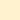

# Favorite Foods WebApp - Assignment 1

Design a Favourite Foods webpage with the specified requirements.

GitHub direct link: https://github.com/jothomas1996/edyoda-fsd/tree/main/1%20-%20favorite%20foods%20webapp%20%5Bassignment%201%5D

View in Codepen: https://codepen.io/jothomas/full/ZErQqNx

GitHub Repository: https://github.com/jothomas1996/edyoda-fsd.git

## Requirements

- You can add any food items of your choice but the page structure should be the same as the reference website.
- Your website should have,
	- a top bar
	- list of food items
	- food sections with images and food names
- You can choose any color theme of your choice.
- Please add smooth scrolling as well.

## Color Palette

| Type | Color |
| --- | --- |
| Primary |  `#F48C06` |
| Text |  `#03071E` |
| Background |  `#FFF1CE` |
